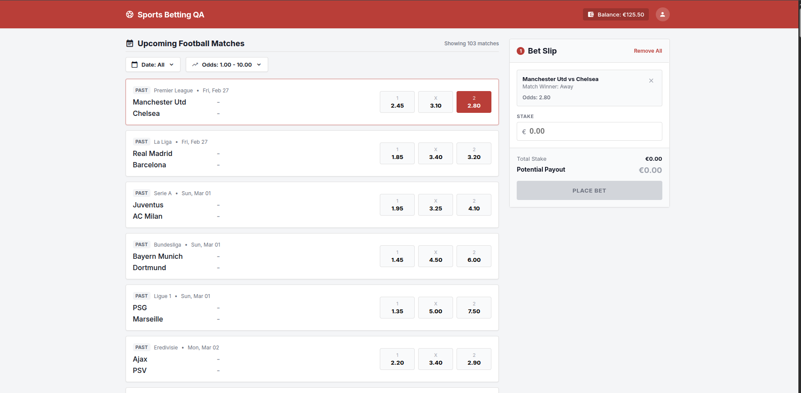
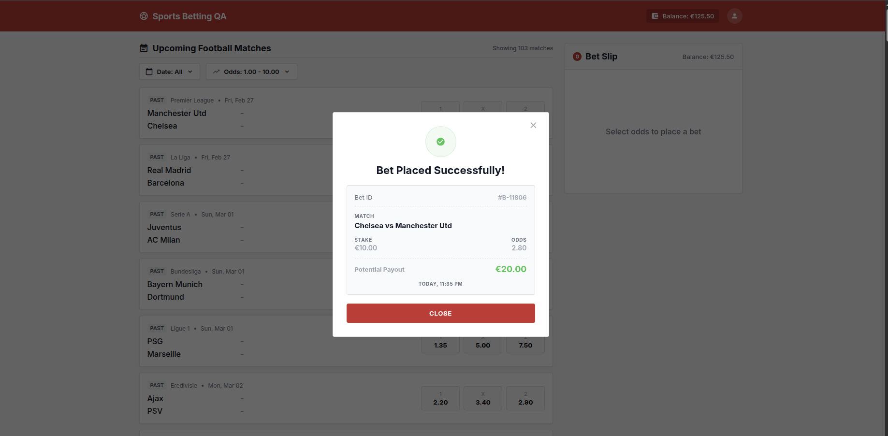
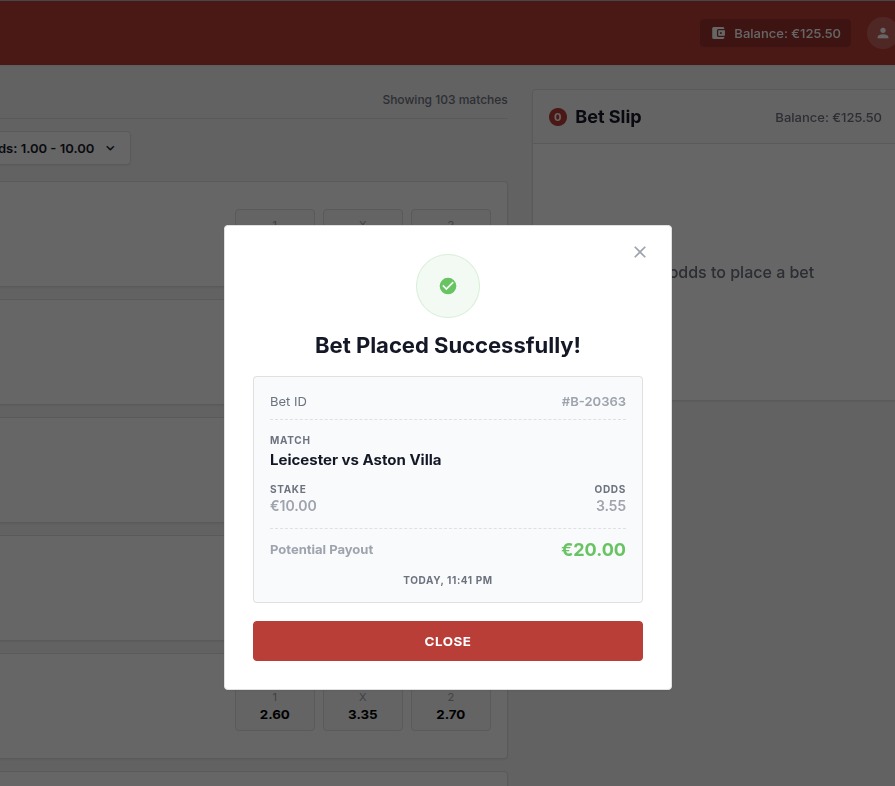
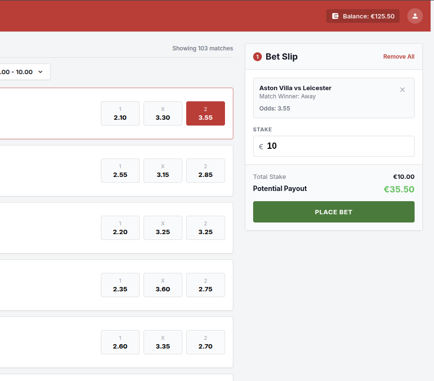
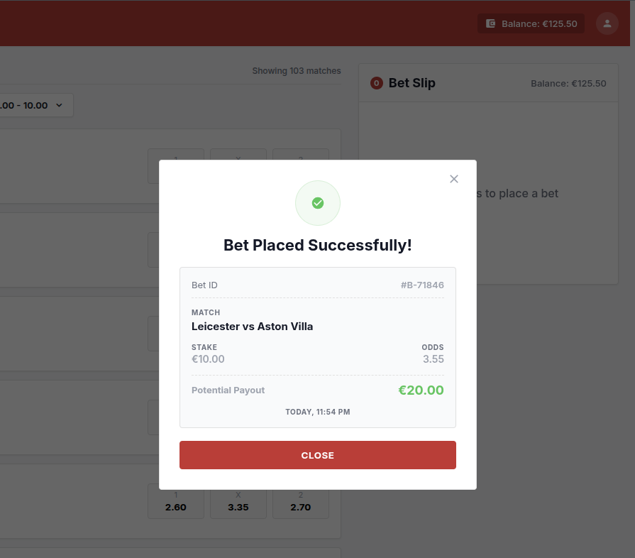
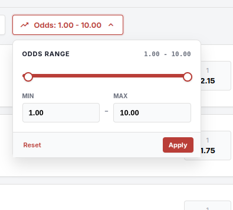
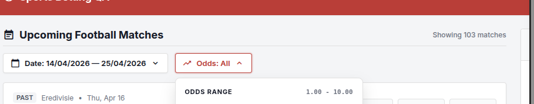

# Bug 1:
**Bug ID & Title:** SBP-07: Match List displays PAST matches and user can place bet
**Severity:** Critical
**Reproduction Steps**
1. Open application as a valid user
2. Don't apply any filters
3. Verify Match list section (Upcoming Football Matches)
4. Identify a match with a kickoff date/time earlier than the current date/time.
5. Select any odds option for that match.
**Expected vs Actual result**
Expected: No past events should be displayed or be selectable for betting
Actual: Past events are shown in the list and user can place bets on them
**Business Impact:** User can place bets on alredy known outcome events. 
**Evidence:** 

# Bug 2:
**Bug ID & Title:** SBP-08: Stake is not deducted from the user's available balance
**Severity:** Critical
**Reproduction Steps**
1. Select a valid match outcome
2. Enter a stake
3. Click on Place Bet
4. Wait for success receipt to be displayed
**Expected vs Actual result**
Expected: stake value should be deducted from user's available balance
Actual: The user's available balance is not updated after bet placement
**Business Impact:** Allows over-betting creating incorrect account balances, leads to financial loss, reconciliattion issues and reduces user's trust in the betting platform.
**Evidence:** 

# Bug 3: 
**Bug ID & Title:** SBP-09: Mis-match between data in Bet Slip and in receipt (potential payload value and match details)
**Severity:** High
**Reproduction Steps**
1. Select a valid match outcome
2. Enter a stake
3. Click on Place Bet
4. Wait for success receipt to be displayed
5. Verify Potential Payout value
6. Verify Match details
**Expected vs Actual result**
Expected: Potential payout value should be correctly calculated/displayed in both Bet slip and in receipt. The order of the teams should be the same in both Bet Slip and receipt
Actual: The potential payout is not correctly displayed/calculated in the receipt and the teams are reversed
**Business Impact:** Confuses the user and reduces user's trust in the betting platform.
**Evidence:** 

# Bug 4: 
**Bug ID & Title:** SBP-10: Odds maximum value in filter is 10.00 not 1000.00
**Severity:** Medium
**Reproduction Steps**
1. Select odds filter
2. Enter max odds > 10.00
3. Click on Apply 
4. Wait for the Upcoming Footbal Matches list to update
**Expected vs Actual result**
Expected: Specification says 1000 is the maximum value for odds
Actual: The maximum value for odds is 10.00
**Business Impact:** False promises for the user (or is a specification mistake?)
**Evidence:** 

# Bug 5: 
**Bug ID & Title:** SBP-11: Number of "Showing matches" doesn't update when filters are applied
**Severity:** Low
**Reproduction Steps**
1. Apply some filters (date or odds)
2. Wait for the Upcoming Footbal Matches list to update
3. Verify the feedback from the list
**Expected vs Actual result**
Expected: Specify the number of showing matches
Actual: It always displayes "Showing 103 matches"
**Business Impact:** Confusing for user
**Evidence:** 
